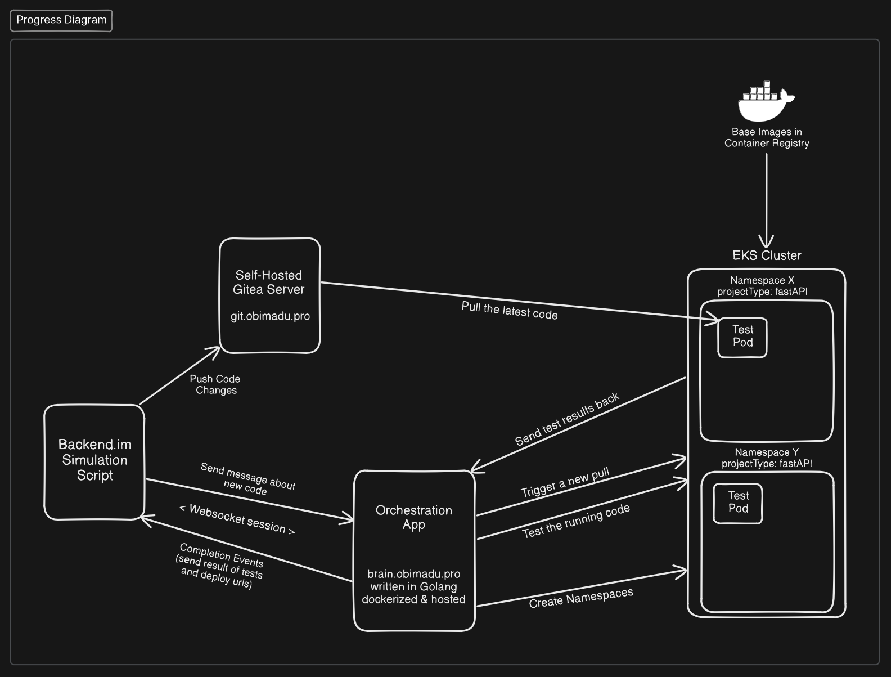

# Automated Commit Testing System for Backend.im



A distributed system for testing Git commits in isolated Kubernetes environments using WebSocket communication. Built to catch regressions before they hit production.

## ⚡️ Features

- **Real-time Test Pipeline** - WebSocket-based test orchestration
- **K8s Isolation** - Dedicated namespaces per test session
- **Commit-by-Commit Testing** - Test multiple commits in sequence
- **Custom Test Commands** - Override default test behavior
- **Failure Forensics** - Detailed error logging and output capture

## 🏗 Architecture

```mermaid
sequenceDiagram
    Client->>Server: Connect via WS
    Client->>Server: Send commit+test command
    Server->>K8s: Create namespace
    Server->>K8s: Deploy test pod
    K8s->>TestPod: Clone repo
    K8s->>TestPod: Checkout commit
    K8s->>TestPod: Run tests
    TestPod->>Server: JSON results
    Server->>Client: Return results
```

## 🔌 Cluster Connection Guide

**Choose your connection method** → [ AWS EKS | Manual Kubeconfig ]

```mermaid
graph TD
    A[Connection Type] --> B{AWS EKS?}
    B -->|Yes| C[Use AWS Mode]
    B -->|No| D[Use Manual Config]
    D --> E[Standalone Kubeconfig]
```

### 1. AWS EKS Mode (Recommended for AWS users)
**Requirements**:
- AWS credentials with EKS access
- Cluster name and region

```bash
# .env configuration
KUBECONFIG_MODE=aws
AWS_ACCESS_KEY_ID=AKIA... 
AWS_SECRET_ACCESS_KEY=secret
AWS_DEFAULT_REGION=us-west-2
KUBE_CLUSTER_NAME=prod-cluster
```

### 2. Manual Kubeconfig Mode
**For**: Non-AWS clusters or pre-configured access

**Steps**:
1. Place kubeconfig in project root:
   ```bash
   mkdir -p kubeconfig
   cp ~/.kube/config kubeconfig/prod-cluster.yaml
   ```

2. Configure environment:
   ```bash
   # .env
   KUBECONFIG_MODE=manual
   KUBECONFIG_FILE=./kubeconfig/prod-cluster.yaml
   ```

3. Verify connection:
   ```bash
   docker compose run --rm backendim-brain kubectl cluster-info
   ```

### 🔍 Connection Troubleshooting

| Error | Solution |
|-------|----------|
|`server has asked for credentials`| Ensure AWS creds are set even in manual mode for AWS-based configs|
|`x509 certificate unknown`| Embed CA cert directly in kubeconfig|
|`permission denied`| Check kubeconfig file permissions: `chmod 600 kubeconfig/*`|
|`no such file`| Verify volume mount path in docker-compose.yml|

## 📂 Project Structure

```
backend.im-infra/
├── deployments/               # Kubernetes deployment templates
│   └── templates/
│       └── fastapi/           # FastAPI-specific resources
│           ├── Dockerfile     # Base image for FastAPI test pods
│           └── test-pod.yaml  # Pod specification for FastAPI tests

├── scripts/                   # Operational scripts
│   ├── git_handler.sh         # Handles repo cloning/checkout
│   ├── healthcheck.sh         # Service health monitoring
│   ├── install-awscli.sh      # AWS CLI setup in containers
│   ├── install-kubectl.sh     # Kubectl installation
│   ├── kube-init.sh           # Cluster connection bootstrap
│   ├── namespace_handler.py   # K8s namespace management
│   └── test-runner.py         # Core test execution logic

├── app/                       # Example FastAPI service (test subject)
│   ├── main.py                # Sample API endpoints
│   ├── tests/                 # Test cases for example service
│   │   ├── test_success.py    # Valid test cases
│   │   └── test_fail.py       # Intentional failure cases
│   └── pyproject.toml         # Python project config

├── internal/                  # Go server implementation
│   ├── handlers/              # WebSocket connection handling
│   │   └── websocket.go       # WS message processing
│   ├── models/                # Data structures
│   │   └── message.go         # WS message formats
│   └── services/              # Core business logic
│       ├── namespace_service.go # K8s ns operations
│       └── test_service.go    # Test execution orchestration

├── cmd/                       # Server entrypoints
│   └── server/
│       └── main.go            # WebSocket server main

├── config/                    # Configuration files
│   ├── config.json            # Active configuration
│   └── config.example.json    # Configuration template

├── docker/                    # Container definitions
│   ├── Dockerfile             # Main application image
│   └── docker-compose.yml     # Local development setup

└── .github/
    └── workflows/             # CI/CD pipelines
        └── cd.yml             # Deployment automation
```

## 🛠 Prerequisites

- Kubernetes cluster (Docker Desktop K8s works)
- `kubectl` configured and working
- Python 3.9+ (client side)
- Go 1.18+ (server side)


## 🚀 Quick Start

### 1. Clone and Prepare

```bash
git clone https://github.com/obiMadu/backend.im-infra
cd backend.im-infra
```

### 2. Server Setup

```bash
# Install dependencies
make deps

# Start server (port 8080)
make run
```

### 3. Client Setup

```bash
python3 -m venv .venv
source .venv/bin/activate
pip install -r app/requirements.txt

# Copy and edit config
cp config.example.json config.json
nano config.json  # Set your repo and commits
```

### 4. Run Tests

```bash
python3 scripts/client.py
```

## ⚙️ Configuration

**config.json**

```json
{
  "ws_url": "ws://your-server-url/ws",
  "repo_url": "https://github.com/your/repo.git",
  "user_id": "your-user-id",
  "chat_id": "your-chat-id",
  "project_type": "fastapi",
  "test_command": "pytest -v tests/network/",
  "commits": ["HEAD~2", "HEAD~1", "HEAD"]
}
```

## 🔥 Custom Test Commands

Override default test behavior in `config.json`:

```json
{
  "test_command": "mvn test -Dtest=SmokeTestSuite"
}
```

Supported formats:

- Simple commands: `npm test`
- Chained commands: `make test && coverage report`
- Script paths: `bash tests/e2e.sh`

## 🚨 Troubleshooting

### "Missing deployment template" Error

Create required K8s templates:

```bash
mkdir -p deployments/templates/fastapi/
# Add your test-pod.yaml here
```

### WebSocket Connection Issues

```bash
# Verify server is running
curl -I http://localhost:8080/health

# Check firewall rules
sudo ufw allow 8080/tcp
```

### K8s Pod Failing

Check pod logs:

```bash
kubectl logs -n im-chat-14-user-14 test-pod
```

## 📋 Test Flow Breakdown

1. Client connects via WebSocket
2. Server creates isolated K8s namespace
3. Test pod deploys with project-specific template
4. Repo is cloned/updated in pod
5. Target commit is checked out
6. Custom test command executes
7. Results stream back via WebSocket

## ⁉️ FAQ

**Q: How are resources cleaned up?**  
Namespaces persist for debugging. Manual cleanup:

```bash
kubectl delete namespace im-chat-14-user-14
```

**Q: Can I modify the test pod?**  
Edit templates in `deployments/templates/<project-type>/test-pod.yaml`

**Q: What's the performance overhead?**  
Each test run uses ~300MB RAM. Scale namespaces as needed.

## 📜 License

AGPL-3.0 - Fuck around and find out edition
